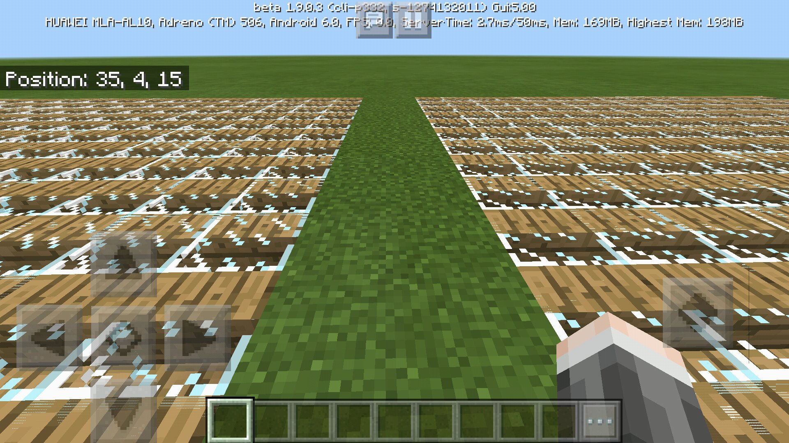
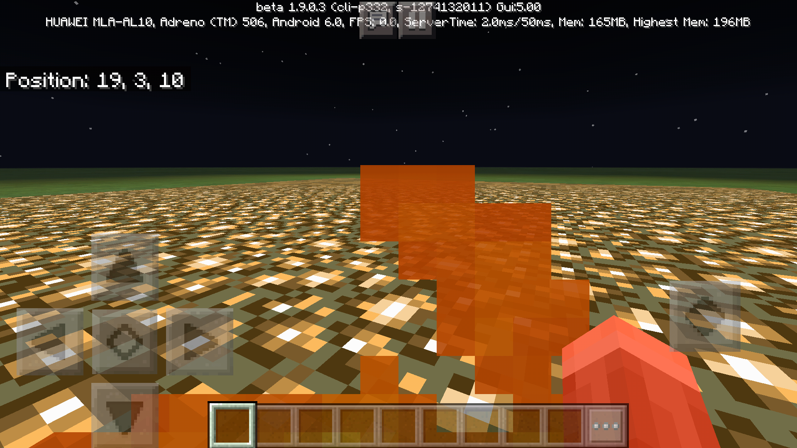

# Convarter
An android app that allows you to edit Minecraft (MCPE) gamemaps with javascripts, create customized flat levels and other features.

Now supports gamemap editing using BlockLauncher-style javascripts.
* Basics:
..* `getBlock(x,y,z)` returns block runtime id.
..* `setBlock(x,y,z,runtimeId)` sets block runtime id.
..* A `runtimeId` is just `(id << 8) | data` for now.
..* `getTile(x,y,z)` returns block id as legacy support.
..* `getData(x,y,z)` returns block data as legacy support.
..* `setTile(x,y,z,id,data)` sets the block's id and data as legacy support.
* With multi-dimension (Overworld/Nether/...) support:
..* `getBlock2(x,y,z,dim)` returns block runtime id.
..* `setBlock2(x,y,z,dim,runtimeId)` sets block runtime id.
..* dim = 0 for Overworld, 1 for the Nether, -1 for the End.
* With two-block-coexist support:
..* `getBlock3(x,y,z,dim,layer)` returns block runtime id.
..* `setBlock3(x,y,z,dim,layer,runtimeId)` sets block runtime id.
..* layer = 0 or 1. The purpose of layer 1 is to allow block coexisting with another.

With this app you can generate huge and complex things in Minecraft that are hard
or impossible to be build manually or using in-game scripts.  

Glass & stair coexist:  
  
Swim in glowstone:  
  
[Generate a 3D maze](https://github.com/oO0oO0oO0o0o00/mcpe-3d-maze-generater):  
  

## Ideas
* Place sand, torch and cactus in space...
* Music railway with super long musics...
* Huge structures...
* Convert HDL files into redstone circuits...
* Import 3D models and... 
* Well, everything up to you... 

## Features that may be added
* Visulized copy|cut|paste in 2d|3d view.
* Convert a game map back to 0.x format.
* Make portals invisible and single-directioned.
* Conversion between Java Edition and Bedrock Edition maps.

## Build & Install
* Go to [release page](https://github.com/oO0oO0oO0o0o00/Convarter/releases).
* You could clone and Build with Android Studio.
* This repo works as a backup, it may or may not be able to be opened on your PC.

## Library projects used
* F43nd1r's [Rhino-android](https://github.com/F43nd1r/rhino-android) to enable script optimization.
* Mozilla's [Rhino](https://developer.mozilla.org/en-US/docs/Mozilla/Projects/Rhino), a javascript
environment.
* [SimpleNBT](https://github.com/boomshroom/SimpleNBT), read|write nbt files e.g. level.dat.
Originally [SpoutDev](https://www.google.com/search?&q=spout.org)'s work, forked by
Boomshroom, since spout was gone.
* Google's [Dx tool](https://android.googlesource.com/platform/dalvik). Here we uses
a repacked version:`'com.jakewharton.android.repackaged:dalvik-dx:7.1.0_r7'`
* [leveldb-mcpe-android](https://github.com/oO0oO0oO0o0o00/leveldb-mcpe-android) thanks to
..* [@litl](https://github.com/litl/android-leveldb)'s,
..* [@mojang](https://github.com/Mojang/leveldb-mcpe)'s and
..* [@google](https://github.com/google/leveldb)'s work.
* Inspired by reverse engineering [@zhuowei](https://github.com/zhuowei)'s
apps. Anyway we're not just copying.